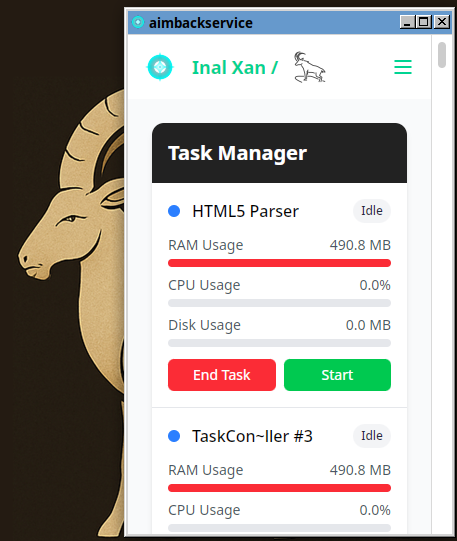

## Authors

- [@Inal Karakhanli](https://www.github.com/nickforhuman)

# 🧠 Infonix Manager

**Infonix Manager** - Rust və Tauri əsasında qurulmuş, Vue.js ilə hazırlanmış sürətli, müasir və çoxplatformalı tapşırıq meneceri tətbiqidir. İstifadəçilərə işləyən prosesləri görmə və "Sonlandır" düyməsi vasitəsilə xüsusi OS xidmətlərini birbaşa dayandırma imkanı verir.

**Infonix Manager** is a fast, modern, and native-like cross-platform task manager application built with **Rust**, **Tauri**, and **Vue.js**. It allows users to view and manage running processes with the unique ability to **terminate specific OS services directly** using the "End" button.

> Yüngül. Təhlükəsiz. Funksional. İnkişaf etdiricilər və peşəkarlar üçün hazırlanmışdır.  
> Lightweight. Secure. Functional. Built for developers and power users.

---

## 🌐 Dəstəklənən Platformalar | Supported Platforms

- ✅ Linux
- ✅ Windows
- ✅ macOS (beta)

---

## 🚀 Xüsusiyyətlər | Features

- 🖥️ **Çoxplatformalı dəstək** | Cross-platform support (Linux, Windows, macOS)
- ⚙️ **Sistem səviyyəli prosesləri sonlandırma** | End system-level processes or services directly from the UI
- 🧩 **Rust və Tauri ilə qurulub** | Built with Rust and Tauri for maximum performance and security
- ⚡ **Vue 3, Vite və Tailwind CSS ilə sürətli interfeys** | Lightning-fast frontend powered by Vue 3, Vite, and Tailwind CSS
- � **Sadə və intuitiv interfeys** | Clean, intuitive interface with modal dialogs and real-time updates
- 🔒 **Təhlükəsiz proses idarəetmə** | Secure process control using Rust system APIs

---

## 🛠 İstifadə olunan Texnologiyalar | Technologies Used

| Səviyyə / Layer         | Texnologiya / Tech Stack                          |
|-------------------------|--------------------------------------------------|
| Ön tərəf / Frontend      | Vue 3 (Composition API), Vite, Tailwind CSS      |
| Nüvə / Backend (Core)    | Rust, Tauri                                      |
| OS İnteqrasiyası / Integration| `sysinfo` və ya oxşar crate-lər / or similar crates for process management |

---

## 📸 Ekran Görüntüləri | Screenshots

  
*Proseslərin siyahısı / List of running processes*

  
* Əməliyyat sisteminin istifadəçilər / Operation system users*

---

## 📥 Qurulum | Installation

```bash
# İnkişaf rejimi / Development mode
npm install
npm run tauri dev

# Produksiya qurulumu / Production build
npm run tauri build
