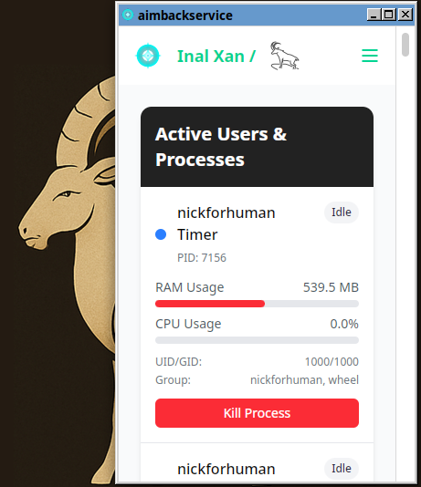

# 🧠 Infonix Manager

**Infonix Manager** is a fast, modern, and native-like cross-platform task manager application built with **Rust**, **Tauri**, and **Vue.js**. It allows users to view and manage running processes with the unique ability to **terminate specific OS services directly** using the "End" button.

> Lightweight. Secure. Functional. Built for developers and power users.

---

### 🇦🇿 **Qısa Təsvir (Azərbaycanca)**  
**Infonix Manager** – Rust və Tauri əsasında qurulmuş, Vue.js ilə hazırlanmış sürətli, müasir və çoxplatformalı tapşırıq meneceri tətbiqidir. İstifadəçilərə işləyən prosesləri görmək və "Sonlandır" düyməsi vasitəsilə xüsusi OS xidmətlərini birbaşa dayandırmaq imkanı verir.  

> Yüngül. Təhlükəsiz. Funksional. İnkişaf etdiricilər və peşəkarlar üçün hazırlanmışdır.

---

## 🌐 Supported Platforms | Dəstəklənən Platformalar

- ✅ Linux  
- ✅ Windows  
- ✅ macOS *(beta)*

---

## 🚀 Features | Xüsusiyyətlər

- 🖥️ **Cross-platform support** (Linux, Windows, macOS)  
- ⚙️ **Terminate system-level processes or services** directly from the UI  
- 🧩 **Built with Rust and Tauri** for high performance and native integration  
- ⚡ **Lightning-fast frontend** using Vue 3, Vite, and Tailwind CSS  
- 🧠 **Clean and intuitive UI** with modal dialogs and real-time updates  
- 🔒 **Secure process control** leveraging low-level Rust system APIs

---

## 🛠 Tech Stack | İstifadə olunan Texnologiyalar

| Layer / Səviyyə        | Technology / Texnologiya                          |
|------------------------|--------------------------------------------------|
| Frontend / Ön tərəf     | Vue 3 (Composition API), Vite, Tailwind CSS      |
| Backend / Nüvə         | Rust, Tauri                                      |
| OS Integration / OS İnteqrasiyası | [`sysinfo`](https://crates.io/crates/sysinfo) or similar crates |

---

## 📸 Screenshots | Ekran Görüntüləri

### 🖼️ Main UI / Əsas İnterfeys  
  
*List of running processes / Proseslərin siyahısı*

### 🖼️ System Users / OS İstifadəçiləri  
  
*Operating system users and services / Əməliyyat sisteminin istifadəçiləri və xidmətlər*

---

## 📥 Installation | Qurulum

```bash
# Development Mode / İnkişaf rejimi
npm install
npm run tauri dev

# Production Build / Produksiya üçün qurulum
npm run tauri build
